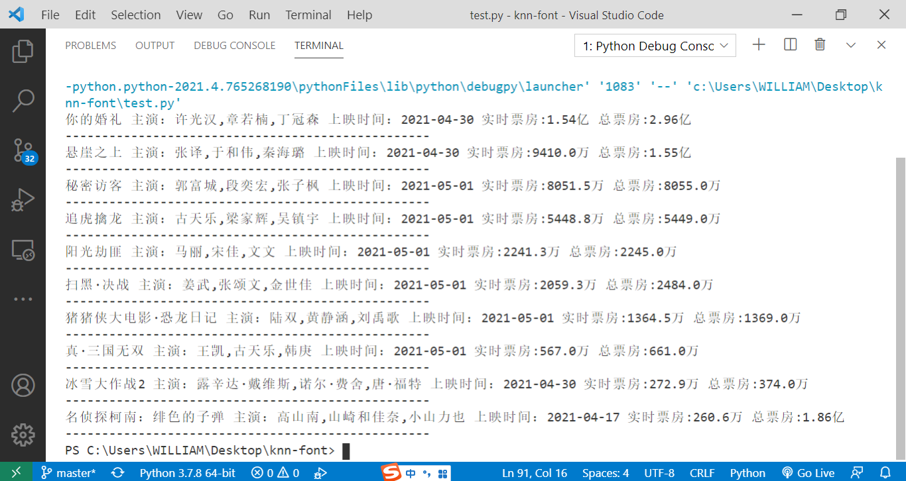

# knn-font
使用sklearn库调用knn算法实现猫眼字体识别

本来想跟随大佬的脚步在猫眼电影实践一波knn（k近邻算法），没想到猫眼电影现在的字体文件是静态的（20210502）。只能使用archive找了几个网址曾出现过的woff字体文件加上这个仓库本来就有的5个一共10个字体文件，一个woff字体10个字符共100个数据。  

因为现在字体文件是静态的用knn有点杀鸡用牛刀了，但是训练数据包含了**目前的静态的字体文件**按照knn k取1的算法 预测的准确率必定是100%，就算网址之后改回动态字体该方法仍然适用。  


```
<!-- 核心knn 算法调用sklearn实现 -->
import numpy as np 
import pandas as pd
from font import get_font_data
from sklearn.impute import SimpleImputer
from sklearn.model_selection import train_test_split
from sklearn.neighbors import KNeighborsClassifier
from sklearn.preprocessing import StandardScaler
import pickle


def main():
	# 处理缺失值
	imputer = SimpleImputer(missing_values=np.nan, strategy='mean')
	data = pd.DataFrame(imputer.fit_transform(pd.DataFrame(get_font_data())))

	# 取出特征值\目标值
	x = data.drop([0], axis=1)
	y = data[0]
	# print(y)

	# 分割数据集
	# x_train, x_test, y_train, y_test = train_test_split(x, y, test_size=0.2,random_state=0)
	# x_train = x.head(30)
	# y_train = y.head(30)
	
	x_train = x.iloc[30:100]
	y_train = y.iloc[30:100]
	x_test = x.iloc[0:30]
	y_test = y.iloc[0:30]
	print('训练集形状',x_train.shape)
	# 标准化
	# std = StandardScaler()
	# x_train = std.fit_transform(x_train)
	# x_test = std.transform(x_test)

	# 进行算法流程
	knn = KNeighborsClassifier(n_neighbors=1)
	# 开始训练
	knn.fit(x_train, y_train)
	# 预测结果
	y_predict = knn.predict(x_test)
	print(y_predict)

	# 得出准确率
	print(knn.score(x_test, y_test))

	# 保存模型
	# method 1 pickle
	# with open('model/knn.pickle','wb') as f:
	# 	pickle.dump(knn,f)

	# 加载模型
	with open('model/knn.pickle','rb') as f:
		knn2 = pickle.load(f)
		print(knn2.score(x_test, y_test))


if __name__ == '__main__':
	main()
```

## 最终效果




## 完整代码
[](https://github.com/skygongque/knn-font/blob/master/test.py)

## 其他
在数据准备过程中使用了numpy和pandas的常规操作借此机会熟悉一下  
另外B站上莫凡大佬的机器学习课真不错（入门必备）  